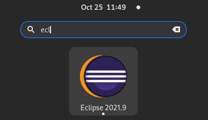

# Fedora 34 Workstation Desktop/menu icon

As a new user coming to Desktop Linux, I like Fedora 34 Workstation because 
it is the only linux distribution that is capable of resuming most of the time 
after putting my computer to sleep. It is also very fast, and capable on my
quite powerful desktop computer (AMD 3950X/5700XT/64GB RAM). But the one thing
that kept bugging me is using Eclipse.

Eclipse and third-party package managers like those that work on linux distributions
is a nightmare. They try to manage the Eclipse distribution in ways that is ill 
conceived and they are usually far behind the realities of Eclipse proper. Also it is
quite nasty to try to update your Eclipse installation and install plugins etc in such
a scenario as I have experienced in the past. But now that the Java package managers
have thrown the towel into the ring, you really can't use Eclipse without downloading
the distribution yourself and use that.

But downloaded Eclipse doesn't work (very) well in the Wayland/Gnome desktop environment
because you have to start Eclipse using a commandline prompt. No icon, it doesn't show
up in the search or applications list. But using the following settings you can make this
happen and have your downloaded Eclipse become a first party on your desktop.

Create a tekst file called `eclipe.desktop` in `~/.local/share/applications/` and add the
following contents (modified for your system/installation of Eclipse obviously):

```
[Desktop Entry]
Version=1.0
Terminal=false
Icon=/home/dashorst/Applications/eclipse/icon.xpm
Type=Application
Categories=Development;
Exec=/home/dashorst/Applications/eclipse/eclipse
Name=Eclipse 2021.9
GenericName=IDE
StartupNotify=true
```

Now all that rests is to update the application database to have this show up in your
application searches:

```
$ update-desktop-database ~/.local/share/applications/
```


This was mostly written for myself to remember how to do this, as the search for a
tutorial for this was quite difficult.
